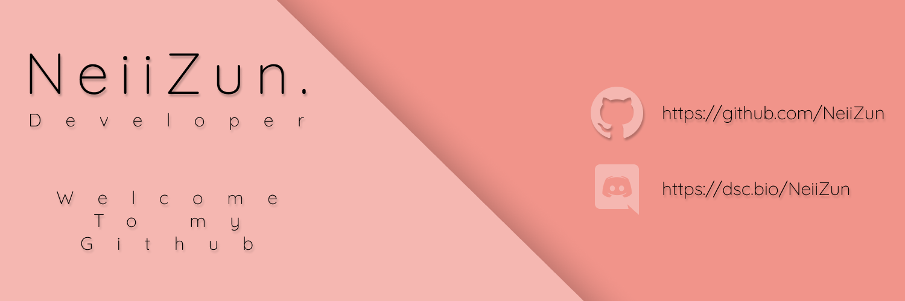

### Hello there

I'm NeiiZun, young Java and python developer, I often code and work for differents projets or customers. I never stop learning more about technologies. I'm currently open to serious projects.

### 🔍 Tools & Technologies

 
 

## 🌟 Github stats and activity

 

